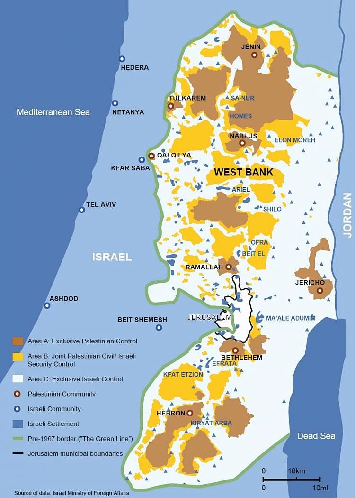

## Who is George and how did I get in touch with him?
George, Co-Founder of the "Right to Movement Initiative", and I connected over a Konrad-Adenauer-Foundation event a week ago, where he presented the "Right to Movement Initiative" and answered questions about Palestine overall.
George Zeidan is 30 years old, a Fulbright awardee with a master's degree from the Price School of Public Policy, University of Southern California and program manager for an international humanitarian organization. He grew up in Jerusalem’s Old City and publishes articles as a freelance writer in [Haaretz](https://www.haaretz.com/misc/writers/WRITER-1.8690510). 

The "Right to Movement Initiative" is a social running group in Palestine.
They are using sports as a tool to highlight the restriction of the movement of Palestinians in the Israeli-occupied territories. In general they want to illustrate the reality of Palestinian life through sports. (More Info on that [here](https://en.wikipedia.org/wiki/Palestinian_freedom_of_movement))
The idea for the Right to Movement Initiative started back in 2012 in Bethlehem, the West Bank city that lies just south of Jerusalem. 
Palestinians wanted to organize a marathon but found it impossible to map the full 42 kilometer route without hitting major obstacles. Therefore they organized a marathon that starts and ends at the same plays.
Furthermore they organized small running communities first in Palestine, but as the Movement grew, all over the world. Noteworthy is that the ratio between female and male runners in the local groups (Palestine) is almost 50/50. That is a big achievement in a conservative, religious state. 
If you want to know more about the right to Movement Initiative you can read this great article by Rosie Scammel: ["This Palestinian running group in Jerusalem fights for the ‘right to movement'"](https://www.pri.org/stories/2020-02-18/palestinian-running-group-jerusalem-fights-right-movement).

## Interview
*George, when you introduced yourself at the KAS event you said: "I am a born and raised Palestinian." This is a pretty big statement because many Palestinians have a sort of identity crisis over and over again, because their origin is so different. How do you deal with these crises and how did it feel to grow up in Jerusalem's Old City, as it is one of the centers of the Middle East conflict? *

I was growing up and was going to school in the old city, but the atmosphere back then was way different. The overall atmosphere in the 90's and early 2000's was significantly Pro "Two-State solution". As a child, as a teenager growing up this was everything we were fed with. This atmosphere vs. what is happening now is a lot different. 
Many of the schools in Jerusalem were force by the Israeli-Educational-System to adapt the Israeli-Education curriculum, otherwise they will not receive the same amount of funding. This led to a situation were schools got divided. Some of them switched to an international curriculum, others adapted to the Israeli curriculum. Back then it was a different "vibe" I would say.

I am very proud of my identity as a Palestinian from Jerusalem, but I know many people that feel differently, including my friends. Maybe I have been privileged to have a decent life, while maintaining the strength of my Identity. For many other people having a decent life or even a life at all is not possible while maintaining the Palestinian identity. So a lot of people have this dilemma.

*What is the reason for this dilemma?*

You are continuously challenged. For example if you want to be a (successful) lawyer in Jerusalem, you will sooner or later be "motivated" to give up your Palestinian identity, because you will have a lot more privileges. There a bunch of feelings and experiences that come up one after the other that leads to you to think about your own interests beyond the ones of the Palestinian society. To give you an example: If you are a Palestinian you have to extreme options: 

1) Living at the West Bank earn 400 Dollars a month, not being able to travel anywhere, the need for permits wherever you will go etc. or

2) Living in Israel earn a decent amount of money and have less restrictions than at the West Bank etc. This does not mean by any means that they have a perfect life they still suffer from equality issues, but still.

Which option would you choose, which one you wanna be like?

*You wrote an article about the fact that Google and Apple did not mark Palestinian territory on their Maps. You organized a running event to protest against Google's and Apple's policy regarding this. Did any of the companies react or could you achieve any results?*

Yes. We were able to start discussions and schedule Meetings with Google and spread our message. The event was mainly organized with the support of the non-profit organization [Rebuilding Alliance](https://www.rebuildingalliance.org). They were communicating with congress and trying to get congressman and congresswomen to comment on the topic, which they did. So in the end Google added a lot more villages to their maps.

*Let's get to the Right to Movement Initiative. You mentioned that in your running groups the ratio between female and male participants was almost balanced at 50/50. This is a pretty big achievement, especially if you consider the fact that Palestine is very religious and conservative. How did you manage to achieve that?*

Creating an atmosphere that is welcoming for women. I think that was our key. The fathers of the girls and women have to be comfortable with the atmosphere, the husbands of the women have to be comfortable with the atmosphere, so that the women can participate over and over again. We wanted to create more or less a "family-vibe" that everybody more or less feels safe. The mentality was always to be protective of each other. Each person provides support for the other. 
Another factor was consistency. By doing the same for a while, we were able to get our agenda forward. Every week at the same location many people were getting motivated to participate and accept what we were doing. The initiative became a part of the culture of the areas where we organized running groups.

*Another quote I wrote down from your presentation was: "Running does not lead to peace. It would just be a symbol and nothing would actually change.". So what was the goal of the Initiative after all? Was it just to connect Palestinians or also to connect Palestinians and Israelis?*

Let me be completely honest with you. The current situation is that the recent political events and the agenda of Israel are signalizing that the wind is blowing completely in a different direction. The credibility of events that would try to connect everybody together is zero, because the Israeli side is voting for governments that does not put a priority on peace with Palestine. For sure it is possible to run together, but the wounds and scars of this conflict are to deep. Even if we get 100 Palestinians and 100 Israelis to run together, does this really mean there could be peace? No. We could run together, but this still would not lead to peace. It would not change what already happened. 
There is something on the political end and something on the social end. Our initiative is on the social end. No matter if there is peace or not it would still have a value. 
In my opinion the Israeli society is getting more conservative and the oppression against Palestinians is getting stronger. Running together will not change that.

*Don't you think if Israelis run in this small Palestinian territory, they might feel that this is not okay and change their future vote?*

They are more than equipped to understand the situation of the occupancy and oppression of the Palestinian people. They vision us as a threat to them. It is a very hard thing to reach out to them and engage with the Israeli society. I mean it is impossible. After everything that happened we agreed that we are better of not engaging at all with the Israeli Society. 

*A little ways down the road "Right to Movement" became pretty big and you had international companies to sponsor your running events, even Nike was interested at some point. But then the Government jumped in and wanted to make your organization political. Why did you decline?*

We do not want to be associated with any political party or agenda. I am talking about local politics. We do not belong to anyone and this is who we are. As soon as we become apart of their institutions it means we are a part of their system, their agenda etc.. Implicitly we would have to agree with everything they do, which we not necessarily do. We want to maintain our local independence.

*After you declined the Government started a a big campaign against you personally and the organization. How did that make you feel? The Government in which you should have faith and trust in, is taking away a project you invested time and energy. Furthermore how does this contribute to the identity crisis, as the government seems to not represent the Palestinian people?*

Certainly the connection you are making is very adequate. This instance is just one of hundreds. This is how they treat and control every other institution, every other initiative all over the country. So you can understand people are really skeptical, which totally contributes to the crisis. If you look at the West Bank and how they handle the situation there or if you look at the scandals about corruption, why would you want to be associated with them? So this definitely contributes to the identity crisis. 

What happened to us was tremendously sad. Honestly it was eye-opening, because it was something I actually never imagined to happen, even from our own government. It definitely was very worrying and cost a lot of emotional pain and anxiety for myself and others. They made us hate what we were doing.

*So is the Initiative still going on or is it banned in Palestine?*

We are still going on. The group is still functioning and we are doing runs, but only at a group level. We are trying to maintain this kind of activity a couple of times a week.

*So to get to another topic: How is the Covid situation in Palestine? There is probably a lot of missing data.*

You should first note that Israel is not doing what they should be doing for Palestinians at the occupied territories at the West Bank, especially on the aspect of healthcare. So that is one thing. The other thing is our own government. The PA does have their own healthcare system, but they do not have complete jurisdiction over Area A, B and C.

{width=300px height=500px}

For example I live in Area C, the gym next to my house is open, because the PA is not able to enforce the regulations. You are talking about whole cities that are in Area C that the PA is not able to control. They can not enforce the regualtions and moreover they can not collect Data from certain areas. In Area A the market is closed, then you cross the street to go to Area C and the market is open. Area C is not under "real" PA control, so there is no authority to enforce the regulations. Therefore the databases lack huge amounts of data, because Area C alone is huge. 

*There was one interesting [Database](https://news.un.org/en/story/2020/02/1057451) that was published containing 112 businesses connected to Israeli settlements in the occupied Palestinian territory. Is this part of the strategy of Israel to occupy territory?*

I mean what they are doing in settlements is mainly giving out incentives to Israelis to live in settlements. I think that by itself is very dangerous. There are different kind of incentives, but you can definitely see a kind of strategy occupy certain territories.

*Palestine is as of today not a member of the United Nations, it is just a non-member observer State. Therefore Palestine is also not listed in  a lot of international datasets, which makes it way harder to extract information about the current situation there. Do you have hope that Palestine will become a member?*

I really hope so. I do not know if it will happen, but I really hope so. Furthermore it is important that Palestine is listed as a real state in databases, without data it is very hard, almost impossible, to find solutions. The best solutions are data-driven solutions, so until we have sufficient data  we will not be able to address a lot of problems that we have.

 