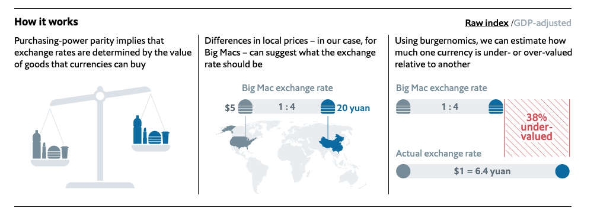

```{r setup, include=FALSE, echo=FALSE}

knitr::opts_chunk$set(echo = TRUE)

library(tidyverse)
library(tidytuesdayR)
library(scales)
theme_set(theme_light())
library(ggrepel)
library(gganimate)
library(transformr)
library(widyr)
tt <- tt_load("2020-12-22")


big_mac <- tt$`big-mac` %>%
  rename(country = name)%>%
add_count(country, name = "country_total")%>%
  arrange(country, date)
```

# Introduction 
I recently had some free time, so I analized the latest TidyTuesday Dataset in R. The Data is about the *Big Mac Index* published by *The Economist*, which is a informell Index to measure the purchasing [power parity](https://en.wikipedia.org/wiki/Purchasing_power_parity) between two countries. If your Economics Knowledge is a little rusty like mine, you should read the Wikipedia links before looking at the Graphs.
The Article on *The Economist*'s Website can be found [here](https://www.economist.com/news/2020/07/15/the-big-mac-index).
{width=650px height=300px}
(Source: https://github.com/MaxMLang/tidytuesday/blob/master/data/2020/2020-12-22/pic2.png )

As you can see in the Graphic the main purpose is to tell, if a currency is over- or undervalued.

## Big Mac Prices in different Countries
First I had a look at the Big Mac Prices over time in each country. We can already see some interesting developments. 

```{r}
big_mac%>%
  filter(country_total == max(country_total))%>%
  mutate(country = fct_reorder(country, local_price, function(.) last(.) / first(.)))%>%
  ggplot(aes(date, local_price, color = country))+
  geom_line()+
  expand_limits(y = 0)+
  facet_wrap(~ country, scales = "free_y")+
  theme(legend.position = "none")+
  labs(x= "Time", y= "Price of Big Mac in local currency")+
  theme(axis.text.x = element_text(angle = 90, hjust = 1))
```

Most of the countries have a relative steady inflation, which you can see by the almost straight line on most of the graphs. 

We should have a look at Taiwan and Switzerland, they are not increasing at all. A reason for that unspecific graph could for example be that the Swiss Franc is a fairly stable currency.

Furthermore we should have a look at the Graph of Argentina. It seems like Argentina had a Hyper-Inflation over the last years, as the graph is increasing rapidly. (More Info about the Inflation in Argentina [here](https://www.ft.com/content/e6f5c436-37d2-11ea-a6d3-9a26f8c3cba4)).

In order to further illustrate this development I calculated the *"Big Mac Inflation"*, which is basically the newest price (2020) divided by the oldest Price (2000). For better comparison (especially because of Argentina) I plotted it on an log10-Scale.

```{r}
big_mac%>%
  filter(country_total == max(country_total))%>%
  group_by(country) %>%
  summarize(big_mac_inflation = last(local_price) / first(local_price))%>%
  arrange(desc(big_mac_inflation))%>%
  mutate(country = fct_reorder(country, big_mac_inflation))%>%
  
  ggplot(aes(big_mac_inflation, country))+
    geom_col()+
    geom_text(aes(label= paste0(round(big_mac_inflation,1))), hjust= 0)+
    expand_limits(x = 130)+
    scale_x_log10(breaks = c(1, 3, 10 ,30, 100))+
    labs(x = "Price of Big Mac in 2020 / Price of Big Mac in 2000" , y = "")
```

Even though the Plot gets a little bit messy by adding the factors to each bar, but I wanted to transfer as much information as possible. We can see again that Taiwan and Switzerland are really stable. The Big Mac Prize is almost the same as 20 years ago. In the US a Big Mac in 2020 costs 2.3 times as much as it has in 2000, while in Argentina it cost 100 times more than in 2000. That's crazy if you think about it. 


The next two graphics are illustrating the Big Mac Index compared to the prices in the US. In the first graphic we used the *usd_raw*, which is not adjusted to each Countries GDP per Capita. In the second graphic we used the *usd_adjusted*. The main idea of the adjusted index is to adress the issue that average burger prices are probaly cheaper in poor countries than in rich ones because the labour costs are lower.

## Raw Index
```{r}
 big_mac%>%
  filter(country_total == max(country_total),
         country != "United States")%>%
  filter(!is.na(gdp_dollar))%>%
  mutate(country = fct_reorder(country, usd_raw))%>%
  ggplot(aes(date, usd_raw))+
  geom_line()+
  geom_hline(color= "blue", lty= 2, yintercept = 0)+
  expand_limits(y = 0)+
  labs(y = "Raw Big Mac Index relative to USD", x= "")+
  facet_wrap(~ country)+
  theme(axis.text.x = element_text(angle = 90, hjust = 1))
  
```

## Adjusted Index
```{r}
 big_mac%>%
  filter(country_total == max(country_total),
         country != "United States")%>%
  filter(!is.na(gdp_dollar))%>%
  mutate(country = fct_reorder(country, usd_adjusted))%>%
  
  ggplot(aes(date, usd_adjusted))+
  geom_line()+
  geom_hline(color= "blue", lty= 2, yintercept = 0)+
  expand_limits(y = 0)+
  labs(y = "Adjusted Big Mac Index relative to USD", x= "")+
  facet_wrap(~ country)+
  theme(axis.text.x = element_text(angle = 90, hjust = 1))
  
```

So if the line is under 0.0 this means the currency is undervalued, if the graph is over the line the currency is overvalued. So the Hong Kong Dollar is undervalued, Brazilian Real was/is overvalued.(More Information on undervalued currency [here](https://budgeting.thenest.com/mean-currency-undervalued-32198.html)).
It seems a bit odd that China is neither over- nor undervalued, because the Chinese Yuan is often a characteristic for being undervalued.


Now I want to illustrate the difference or better the advantage of the adjusted Big Mac Index. Have a look at the next graph, The *Raw Index* relative to the USD is plotted against the GDP per capita in dollars.

```{r}
 big_mac%>%
    filter(country_total == max(country_total))%>%
    filter(date == max(date))%>%
  ggplot(aes(gdp_dollar, usd_raw))+
      geom_point()+
      geom_text_repel(aes(label = country))+
      geom_smooth(method = "lm")+
      labs(x = "GDP per capita (dollars)",
           y = "Raw Big Mac Index relative to USD")
```

In Indonesia Big Macs are cheaper then expected based on the currency conversion rate. However this is not really suprising because Indonesia's GDP per Capital is really low. 
It makes more sense to have a look at Countries that are poor, but the Big Mac price is fairly expensive or rich countries with a fairly cheap big mac price. 
So  the adjusted Index adresses the problem that  average burger prices are cheaper in poor countries than in rich ones because the labour costs are lower. 

```{r}
 big_mac%>%
    filter(country_total == max(country_total))%>%
    filter(date == max(date))%>%
  ggplot(aes(gdp_dollar, usd_adjusted))+
      geom_point()+
      geom_text_repel(aes(label = country))+
      geom_smooth(method = "lm")+
      labs(x = "GDP per capita (dollars)",
           y = "Adjusted Big Mac Index relative to USD")
```

As you can see the Trend Line is a lot flatter and we can see more clearly which currencies are over- or undervalued, no matter how high or low the GDP per Capita is. Of course the Big Mac price can be influenced by policies, political orientation etc., but overall I believe this graph is pretty nice.

A different approach visualizing this data is by a barplot. Have a look at the next graph.

```{r}
 big_mac%>%
    filter(country_total == max(country_total), country!= "United States")%>%
    filter(date == max(date))%>%
    mutate(country = fct_reorder(country, usd_adjusted))%>%
    ggplot(aes(usd_adjusted, country))+
    geom_col()+
    labs( x ="Big Mac Index relative to USD (GDP     adjusted)", y = "")
```

It is basically the same Information that gets illustrated. Thailand is very overvalued, while Hong Kong is undervalued. In my opinion one should be careful interpeting 2020 Data because the pandemic mixed up a lot of, especially economic Data. However this Data set ends at 7th of January 2020 so the effects of the lockdowns and the Covid-19 crisis are not influencing the rates. (If you want to have a look at the data documentation click [here](https://github.com/MaxMLang/tidytuesday/tree/master/data/2020/2020-12-22)).

I decided to animate the last two (adjusted) Big Mac Index plots in order to add the development over time.

### Animated scatter plot
```{r, echo=FALSE}
 big_mac%>%
    filter(country_total == max(country_total, country!= "United States"))%>%
    filter(!is.na(gdp_dollar))%>%
  ggplot(aes(gdp_dollar, usd_adjusted))+
      geom_point()+
      geom_text_repel(aes(label = country))+
      geom_smooth(method = "lm")+
      transition_time(date)+
      labs(x = "GDP per capita (dollars)",
           y = "Adjusted Big Mac Index relative to USD",
           title = "{frame_time}") 
```

### Animated bar plot
```{r, echo=FALSE}
 big_mac%>%
    filter(!is.na(gdp_dollar))%>%
    filter(country_total == max(country_total, country!= "United States"))%>%
    mutate(country = fct_reorder(country, usd_adjusted))%>%
    ggplot(aes(usd_adjusted, country))+
    geom_col()+
    transition_time(date)+
    labs( x ="Big Mac Index (GDP adjusted)", y = "",
          title = "{frame_time}")
```

These are just some basic plots from a statistican's perspective. As I am not an expert on the field of economics some graphs or approaches may be misleading, which is clearly not intended. Another Idea I had was creating a Map representing the most over- or undervalued currencies. 
I think one should also consider the fact that some currencies have a higher correlation than others. For Example the Singapore Dollar and the US Dollar could have a higher correlation than the US Dollar and the Brazilian Real. That would also be an interesting approach looking at things.

Overall I really enjoyed learning with this data set, even though I hate to admit that exchange rates are sometimes pretty confusing for me. 
Anyway, *"Practice makes perfect"*.

# Credits
Most of the Ideas and code are from David Robinson ([YT](https://www.youtube.com/user/safe4democracy), Github[https://github.com/dgrtwo]) I mainly do the analysis on my own inspired by his videos in order to practice and learn new code pieces. Furthermore I like adding my own thoughts, so I post them here on my website.

