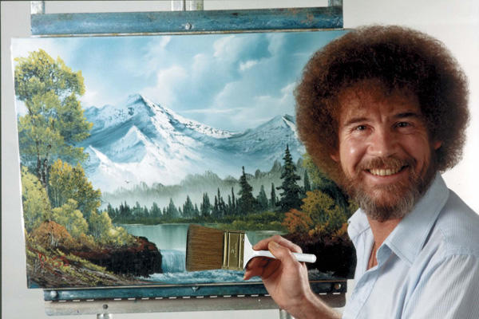

```{r setup, include=FALSE}
knitr::opts_chunk$set(echo = TRUE)
```
I recently came across Bob Ross' famous TV Show "The Joy of Painting", which is absolutely amazing. Let's be honest, is there one person that does not love listening to Bob Ross? 
{width=300px height=200px}


However, as I myself am not a great painter, I thought I will paint in my own way... exactly ggplot and datasets. So here I am answering some basic questions from the Bob Ross Tidy Tuesday [dataset](https://github.com/rfordatascience/tidytuesday/tree/master/data/2019/2019-08-06).

Have fun with the graphs and as always I am happy to receive feedback. :)

### Preparations and Import
```{r}
library(tidyverse)
theme_set(theme_classic())

bob_ross <- readr::read_csv("https://raw.githubusercontent.com/rfordatascience/tidytuesday/master/data/2019/2019-08-06/bob-ross.csv")
```

### Data cleaning and wrangling
```{r}
b_ross_gathered <- bob_ross %>%
  janitor::clean_names() %>%
  gather(element, present, -episode, -title) %>%
  filter(present == 1) %>%
  mutate(title = str_to_title(str_remove_all(title, '"')),
         element = str_to_title(str_replace(element, "_", " "))) %>%
  select(-present) %>%
  extract(episode, c("season", "episode_number"), "S(.*)E(.*)", 
          convert = TRUE, remove = FALSE) %>%
  arrange(season, episode_number)
```

### What elements are painted the most often in Bob Ross' TV Show?
```{r}
b_ross_gathered %>%
  count(element, sort = TRUE) %>%
  head(20) %>%
  mutate(element = fct_reorder(element, n)) %>%
  ggplot(aes(element, n)) +
  ggtitle("Top 20 most occuring elements\nin Bob Ross paintings")+
  xlab("Number of occurences")+
  ylab("Elements in the picture")+
  scale_y_continuous(breaks = seq(0,400,50))+
  geom_col()+
  coord_flip()+
  theme_bw()
```

### How have Ross' paintings been changing over time?

```{r}
by_season_element <- b_ross_gathered %>%
  filter(!element %in% c("Tree", "Trees")) %>%
  group_by(season) %>%
  mutate(number_episodes = n_distinct(episode)) %>%
  count(season, element, number_episodes, sort = TRUE) %>%
  mutate(percent_included = n / number_episodes) %>%
  group_by(element) %>%
  mutate(element_total = sum(n)) %>%
  ungroup()

by_season_element %>%
  filter(element_total >= 50) %>%
  ggplot(aes(season, percent_included)) +
  geom_line() +
  scale_y_continuous(labels = scales::percent_format()) +
  expand_limits(y = 0) +
  facet_wrap(~ element)+
  theme_light()+
  xlab("Season")+
  ylab("Percentage included in Painting")+
  ggtitle("Development of Elements included in \nBob Ross's Paintings")
```

### Credits
Most of the Ideas and code are from David Robinson (YT, Github[https://github.com/dgrtwo]) I mainly do the analysis on my own inspired by his videos in order to practice and learn new code pieces. Furthermore I like adding my own thoughts, so I post them here on my website.

